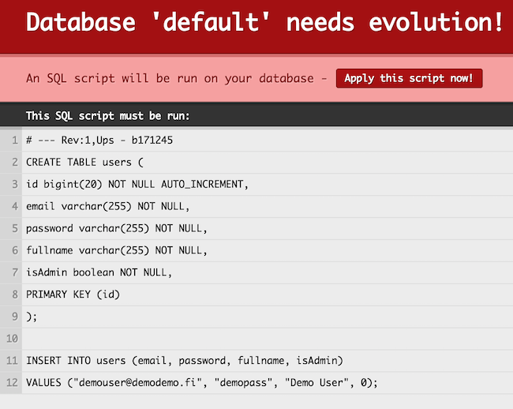

# Database access

## Prerequisities

First you have to install MySQL database. Easiest way to do is to use `brew`.

```
$ brew install mysql
```

Now you can connect to database using root user. By default there is no password.

```
$ mysql -u root
```

Next you have to create a new database, new user and set the permissions. Run the following SQL statements.

```
mysql> CREATE DATABASE demodb;
mysql> GRANT ALL PRIVILEGES ON demodb.* TO 'demouser'@'localhost' IDENTIFIED BY 'password123';
mysql> FLUSH PRIVILEGES;
mysql> QUIT;
```

Next you test the connection with password `password123`.

```
$ mysql -u demouser -p demodb
```

## Database evolutions

Database evolution is a way to handle database schema changes. Evolutions uses incremental changes and every change is
defined in different SQL script.

Add following dependencies to `build.sbt` file.

```scala
evolutions,
"com.typesafe.play" %% "anorm" % "2.4.0",
"mysql" % "mysql-connector-java" % "5.1.36"
```

Your dependencies might look like this:

```scala
libraryDependencies ++= Seq(
  jdbc,
  cache,
  ws,
  specs2 % Test,
  evolutions,
  "com.typesafe.play" %% "anorm" % "2.4.0",
  "mysql" % "mysql-connector-java" % "5.1.36"
)
```

Next you have uncomment/add following lines from `conf/application.conf`.

```
db.default.driver="com.mysql.jdbc.Driver"
db.default.url="jdbc:mysql://127.0.0.1/demodb"
db.default.username="demouser"
db.default.password="password123"

play.evolutions.enable=true
```

Here we defined the **default** database connection settings and enable evolutions.


Create a new directory: `conf/evolutions/default` and create a new file called `1.sql`. This will be your first database evolution so basically it will create tables and initial data.

In the future, when your database evolves, you have to create a new file called `2.sql`. Then `3.sql` and so on. Every evolution increases the number of the file.

This will be the content of `1.sql` file:

```
# Users schema

# --- !Ups

CREATE TABLE users (
    id bigint(20) NOT NULL AUTO_INCREMENT,
    email varchar(255) NOT NULL,
    password varchar(255) NOT NULL,
    fullname varchar(255) NOT NULL,
    isAdmin boolean NOT NULL,
    PRIMARY KEY (id)
);

INSERT INTO users (email, password, fullname, isAdmin)
VALUES ("demouser@demodemo.fi", "demopass", "Demo User #1", 0);
INSERT INTO users (email, password, fullname, isAdmin)
VALUES ("demouser2@demodemo.fi", "demopass2", "Demo User #2", 0);


# --- !Downs

DROP TABLE users;
```

Note that script contains two sections: Ups and Dows. **Ups** are used when database evolves forward. **Downs** are used when we want to rollback the change. Make sure these two match!

Play Framework handles evolutions automatically as long as there are scripts in the evolution directory. If you run your app in *development* mode, evolutions are checked every request. In *production* mode evolutions are checked only when the app is started.

So, now you can run your app and go to `http://localhost:9000`.

```
$ sbt run
```

In browser you should see an error saying your database needs evolution.


Click `Apply this script now!` to run the evolution.

## Anorm

Create a new directory called `app/models` and add there a new Scala class called `User`.

```scala
package models

import anorm._
import anorm.SqlParser._
import play.api.db.DB
import play.api.Play.current

case class User(id: Int, email: String, fullname: String, isAdmin: Boolean)

object User {

  val anormParser = {
    get[Int]("id") ~
      get[String]("email") ~
      get[String]("fullname") ~
      get[Boolean]("isAdmin") map {
      case id ~ email ~ fullname ~ isAdmin => User(id, email, fullname, isAdmin)
    }
  }

  def listAll(): List[User] = DB.withConnection() { implicit connection =>
    SQL("SELECT * FROM users").as(User.anormParser.*)
  }

  def find(id: Int): Option[User] = DB.withConnection() { implicit connection =>
    SQL("SELECT * FROM users WHERE id = {id}").on("id" -> id).as(User.anormParser.singleOpt)
  }
}
```

Make sure the `index` method in `app/controllers/Application` class looks like this:

```scala
class Application extends Controller {

  def index = Action {
    val users = User.listAll()
    val user = User.find(1)

    Ok(views.html.index(users, user))
  }

}
```

Finally, change `app/views/index.scala.html` file:

```
@(users: List[User], user: Option[User])

@main("Welcome to Play") {

    <h2>User list</h2>
    <ul>
    @for(u <- users) {
        <li>@u.email (@u.fullname)</li>
    }
    </ul>

    <h2>Single user</h2>
    @if(user.isDefined) {
        <p>@user.get.email (@user.get.fullname)</p>
    }

}

```
