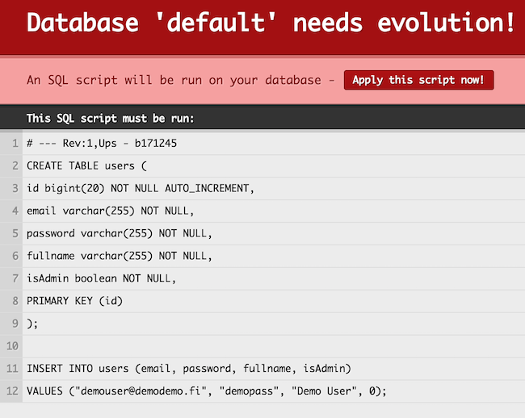
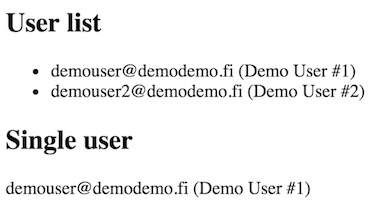

# README-anorm-mysql-evolutions

The [anorm](https://www.playframework.com/documentation/switch/2.4.x/ScalaAnorm) data access layer uses plain SQL to interact with a database.

## Setting up MySQL

Easiest way to do this is to use `brew` (on OS X).

```
$ brew install mysql
```

You may or may not want to launch MySQL automatically at computer restart. Check the console output of the installation for your options (or if you missed them, do `brew info mysql`).

To launch MySQL manually:

```
$ mysql.server start
```

## Setting up a database

Now you can connect to database using root user. By default there is no password.

```
$ mysql -u root
```

Next you have to create a new database, new user and set the permissions. Run the following SQL statements.

```
mysql> CREATE DATABASE demodb;
mysql> GRANT ALL PRIVILEGES ON demodb.* TO 'demouser'@'localhost' IDENTIFIED BY 'password123';
mysql> FLUSH PRIVILEGES;
mysql> QUIT;
```

Next you test the connection with password `password123`.

```
$ mysql -u demouser -p demodb
```

If you get to the `mysql>` prompt, all is fine.

## Database evolutions

Database evolution is a way to handle database schema changes. [Evolutions](https://www.playframework.com/documentation/2.4.x/Evolutions) uses incremental changes and every change is
defined in different SQL script.

<font color=red>@Mika: I'd leave the file creation instructions away, since the files are already there in this branch. Helps maintenance, too. However, this section has so much of wonderful text *explaining* the details, it should probably be there.

Another approach is to let people read the official instructions. Just provide them a bare minimum (but working) template to get going.

What do you think? AKa211015
</font>

Add following dependencies to `build.sbt` file. Note that in this phase you don't actually need anorm dependency, but we add it because you'll need it later.

```scala
evolutions,
"com.typesafe.play" %% "anorm" % "2.4.0",
"mysql" % "mysql-connector-java" % "5.1.36"
```

Your dependencies might look like this:

```scala
libraryDependencies ++= Seq(
  jdbc,
  cache,
  ws,
  specs2 % Test,
  evolutions,
  "com.typesafe.play" %% "anorm" % "2.4.0",
  "mysql" % "mysql-connector-java" % "5.1.36"
)
```

Next you have uncomment/add following lines from `conf/application.conf`.

```
db.default.driver="com.mysql.jdbc.Driver"
db.default.url="jdbc:mysql://127.0.0.1/demodb"
db.default.username="demouser"
db.default.password="password123"

play.evolutions.enable=true
```

Here we defined the **default** database connection settings and enable evolutions.


Create a new directory: `conf/evolutions/default` and create a new file called `1.sql`. This will be your first database evolution so basically it will create tables and initial data.

In the future, when your database evolves, you have to create a new file called `2.sql`. Then `3.sql` and so on. Every evolution increases the number of the file.

This will be the content of `1.sql` file:

```sql
# Users schema

# --- !Ups

CREATE TABLE users (
    id bigint(20) NOT NULL AUTO_INCREMENT,
    email varchar(255) NOT NULL,
    password varchar(255) NOT NULL,
    fullname varchar(255) NOT NULL,
    isAdmin boolean NOT NULL,
    PRIMARY KEY (id)
);

INSERT INTO users (email, password, fullname, isAdmin)
VALUES ("demouser@demodemo.fi", "demopass", "Demo User #1", 0);
INSERT INTO users (email, password, fullname, isAdmin)
VALUES ("demouser2@demodemo.fi", "demopass2", "Demo User #2", 0);


# --- !Downs

DROP TABLE users;
```

Note that script contains two sections: Ups and Dows. **Ups** are used when database evolves forward. **Downs** are used when we want to rollback the change. Make sure these two match!

Play Framework handles evolutions automatically as long as there are scripts in the evolution directory. If you run your app in *development* mode, evolutions are checked every request. In *production* mode evolutions are checked only when the app is started.

So, now you can run your app and go to `http://localhost:9000`.

```
$ sbt run
```

In browser you should see an error saying your database needs evolution.


Click `Apply this script now!` to run the evolution.

## Anorm

Create a new directory called `app/models` and add a new Scala class called `User`.

```scala
package models

import anorm._
import anorm.SqlParser._
import play.api.db.DB
import play.api.Play.current

case class User(id: Int, email: String, fullname: String, isAdmin: Boolean)

object User {

  val anormParser = {
    get[Int]("id") ~
      get[String]("email") ~
      get[String]("fullname") ~
      get[Boolean]("isAdmin") map {
      case id ~ email ~ fullname ~ isAdmin => User(id, email, fullname, isAdmin)
    }
  }

  def listAll(): List[User] = DB.withConnection() { implicit connection =>
    SQL("SELECT * FROM users").as(User.anormParser.*)
  }

  def find(id: Int): Option[User] = DB.withConnection() { implicit connection =>
    SQL("SELECT * FROM users WHERE id = {id}").on("id" -> id).as(User.anormParser.singleOpt)
  }
}
```

`AnormParser` defines how SQL result is mapped to object. In this case we defined, that database field `id` is integer, `email` is string on so on. Finally we create a new object using these strong-typed values.

The two methods are examples how you can fetch lists and single rows from database.

Next make sure the `index` method in `app/controllers/Application` class looks like this:

```scala
class Application extends Controller {

  def index = Action {
    val users = User.listAll()
    val user = User.find(1)

    Ok(views.html.index(users, user))
  }

}
```

Here we fetch all users from the database and get a single user using ID 1. 

Finally, change `app/views/index.scala.html` file:

```scala
@(users: List[User], user: Option[User])

@main("Welcome to Play") {

    <h2>User list</h2>
    <ul>
    @for(u <- users) {
        <li>@u.email (@u.fullname)</li>
    }
    </ul>

    <h2>Single user</h2>
    @if(user.isDefined) {
        <p>@user.get.email (@user.get.fullname)</p>
    }

}

```

This is a simple HTML template which displays the result.

Now you can run your app and you should see the results coming from the database.

