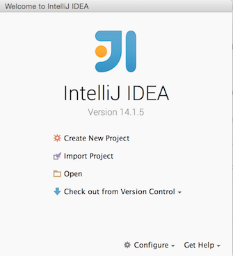
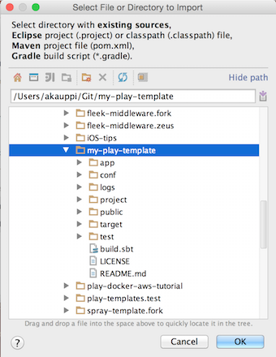
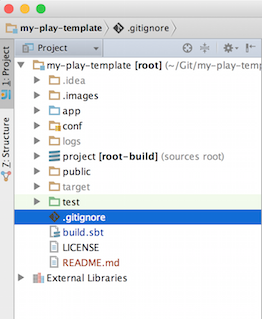

# play-templates

This repository provides a structured way to get Play templates, to start your actual project on.

It goes like this:

- the basic template is in the `master` branch. This is derived from the official [Play 2.4 documentation](https://www.playframework.com/documentation/2.4.x/NewApplication) by `activator new my-play-template play-scala`. However:
  - We are using a globally installed activator (e.g. from Homebrew) instead of the local copy. Meaning `activator*` files are removed from the sources and `sbt run|test` are used in development.
  
  
## Requirements  
  
- `activator` installed
- `sbt` installed
- JVM 8 installed

e.g. on OS X install [Homebrew](http://brew.sh) and then:

`$ brew install activator sbt`


## Updates

The project intends to be always kept up-to-date with latest stable releases (i.e. it may be ahead of what Activator template would give you).

## Branches

Unlike with Activator, because we are using Git we can offer a layered approach to templating.

- `master` branch has the basic setup (e.g. Play, sbt, Scala versions)
  - `anorm-mysql-evolutions` branch adds the [Anorm](https://www.playframework.com/documentation/2.4.x/ScalaAnorm) database library, using MySQL and [Evolutions](https://www.playframework.com/documentation/2.4.x/Evolutions)
  - ...
  
The branches are supposed to be kept independent of each other, so that merging any branch with any other is possible. This way, one can e.g. set up a project that uses TypeScript for front end scripts and some database storage for the backend:

```
$ git checkout ...URL here tbd...
$ git merge typescript
$ git merge anorm
```
This means:

- common changes must always be done in the master branch
- **changes to non-master branches must NEVER be merged to master** (i.e. keep master generic)

## Opening in the IDE

We use [IntelliJ IDEA 14 CE](https://www.jetbrains.com/idea/) for the development.

In the welcome wizard (close any open projects to see it), press Import Project:



Select the folder 



.. approve 'Import project from external model' > SBT

You might check 'Use auto-import'. It makes IntelliJ to resolve all the changes made to the project automatically every time you refresh your project.

After the import, you should see this:




## Running

See the Play instructions.

- on the command line: `sbt run`
- open `http://localhost:9000` in a browser
- edit e.g. `app/controllers/Application/` in the IDE
  - refresh the browser. You should see the changes (or an error message)

## Contributions

If sending PR's, please pay attention that the changes are always targeting the right branch.

## References

- [Play 2.4 highlights](https://www.playframework.com/documentation/2.4.x/Highlights24)
- [Play 2.4 migration guide](https://www.playframework.com/documentation/2.4.x/Migration24)
- [Play 2.4 documentation](https://www.playframework.com/documentation/2.4.x/)
  - [Anatomy of a Play application](https://www.playframework.com/documentation/2.4.x/Anatomy)
  - [play.api.libs.json](https://www.playframework.com/documentation/2.4.x/ScalaJson)

<br />
